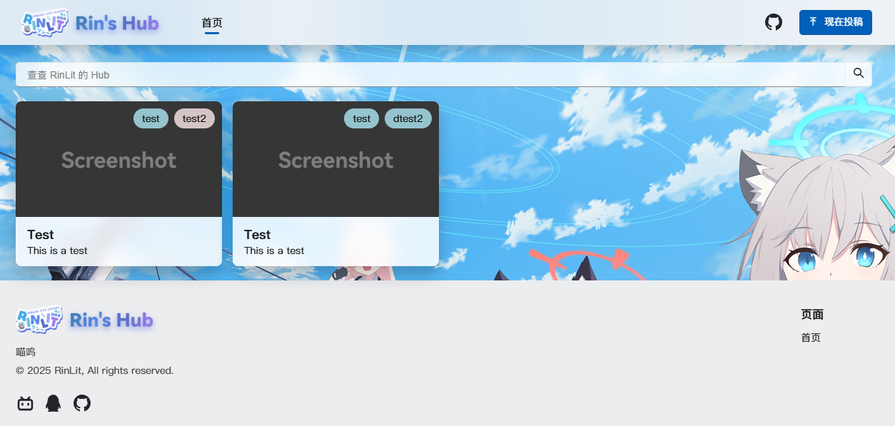

<div align="center">

<h1>Rin's Hub</h1>
<p>收藏了一些关于我的有趣东西</p>
<p>Some interesting things about me</p>


[](https://github.com/RinLit-233-shiroko/Rin-sHub)
[](https://github.com/RinLit-233-shiroko/Rin-sHub)

[现在投稿](#如何投稿) | [在线查看](https://hub.rinlit.cn) | [许可证](#许可证)

</div>

<hr>

## 介绍 / Introduction

本项目将使用原生 HTML、CSS 和 JavaScript 编写，展示亿些 [Class Widgets](https://github.com/Class-Widgets/Class-Widgets) 交流群或关于我的奇怪有趣语录/东西。欢迎前来投稿。

当然，这个项目你也可以用哦如果你也希望拥有的话。

> [!TIP]
> 
> 在线预览：[Rin's Hub](https://hub.rinlit.cn)

### 截图

目前还没任何投稿喵~

### 特性
- 拥有类似于 Fluent Design 的优雅、美观的界面；
- 使用瀑布流布局，适合展示大量不规则内容；
- 独特的“Tag”标签功能，可以快速筛选内容；
- 内置的Filter(搜索功能)，可以过滤到感兴趣的内容
- 使用**原生** HTML、CSS 和 JavaScript 编写，没错，原生。

## 如何投稿
如果你想为此投稿，请按照以下步骤：

1. 🍴 Fork 本仓库；
2. 🔍 在 `./updates` 中能看见 `images.json` 文件和 `/images` 文件夹，请在其中添加你的内容；
    
    在 `images.json` 文件中，添加你的内容，格式如下：
    
    ```json
   {
        "tags":{  // 标签
            "涩涩": "yellow",
            "test2": "red"
        },
        
        "tags_colors": [
           "red",
           "yellow",
           "green",
           "不要更改此处！"
        ],
        
        "hub_items": [  // 内容列表
              {
                "title": "Test",  // 标题
                "image": "blank.png",  // 图片名称，请将您投稿的图片放在 ./updates/images 文件夹中
                "description": "This is a test",  // 描述
                "tags": ["test", "test2"]  // 标签，可以打多个
              }
        ]
    }
    ```
3. 📷 在 `./updates/images` 文件夹中添加你的图片，图片名称请与 `images.json` 文件中的 `image` 字段对应；
4. 🎉 完成！在提交 PR 并通过审核被合并后，你的内容将会出现在网站上。

## 许可证
本插件采用了 MIT 许可证，详情请查看 [LICENSE](LICENSE) 文件。

Copyright © 2025 RinLit, All rights reserved.

## 鸣谢

### 贡献者
感谢这些为Hub投稿/贡献的同学:
[](https://github.com/RinLit-233-shiroko/Rin-sHub/graphs/contributors)

### 使用的资源

- [Fluent UI System Icons](https://github.com/microsoft/fluentui-system-icons)
- [各大群友设的精](#)
